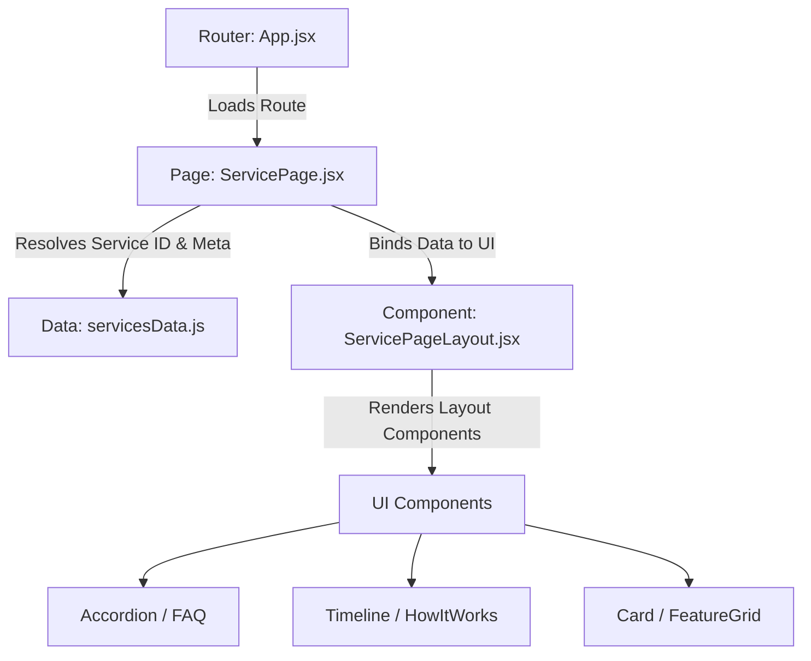

# Impact Health Design System & Architecture Guidelines

This document outlines the UI/UX design language and Clean Architecture pattern for "Impact Health".

## 1. Design System & Aesthetics

### Color System
Consistent with premium, modern healthcare platforms, the following palette is implemented:
- **Primary Blue (`#0F4C81`)**: Trustworthy, corporate, enterprise-grade blue.
- **Secondary Teal (`#14B8A6`)**: Clean, accessible, modern healthcare branding teal.
- **Accent Blue (`#2AA8FF`)**: High-contrast, dynamic action accent blue.
- **Background (`#FFFFFF`)**: Pure clean canvas.
- **Alternate Background (`#F8FBFF`)**: Soft, cool-gray-blue backdrop for content grouping.
- **Text (`#111827`)**: Rich charcoal-slate for maximum readability.
- **Secondary Text (`#4B5563`)**: Comfortable contrast for descriptions.
- **Border (`#E5E7EB`)**: Subtle, crisp separator.

### Background Pattern & Depth
The premium healthcare background features a white base with soft sky blue radial gradients and a tiny dotted grid pattern:
- **Dots**: Tiny circular dots (`1.5px`) spaced `24px` apart, with `10%` opacity and colored `#A7D8FF`.
- **Gradients**: Multiple soft radial overlays blending from top-left toward center.
- **Depth**: Subtle shadowing on sections, avoiding large shapes, noise, or glassmorphism.

### Typography
- **Primary Font**: `Inter` or `Manrope` for maximum readability.
- **Headings**: Large, bold, display-grade styles with comfortable line height (`leading-tight`, `tracking-tight`).
- **Body**: Relaxed body copy (`text-body-md` / `text-body-lg`) with generous line-height (`1.6`).

### Card Style
Premium, enterprise-grade white cards:
- **Border Radius**: `24px` (`rounded-3xl` / `1.5rem`).
- **Background**: Pure white.
- **Border**: Soft border (`border border-[#E5E7EB]/50`).
- **Shadow**: Custom light ambient shadow.
- **Hover Effects**:
  - Lift vertically by `6px` (`-translate-y-1.5`).
  - Increased shadow depth for hover state.
  - Border transition to primary blue (`border-[#0F4C81]`).
  - Arrows slide slightly (`translate-x-1`).

### Animations
Subtle, high-performance interactions powered by `motion/react`:
- **Hero**: Fade Up animation on load.
- **Cards**: Fade Up + Staggered entrance for lists.
- **Images**: Soft fade + scale effect (`scale-100` -> `scale-103`).
- **Timeline**: Grow-line animation tracking reading progress.
- **FAQ**: Smooth, fluid accordion expand/collapse.
- **Buttons**: Micro-scale interaction on hover/click (`scale-100` -> `scale-103`).

---

## 2. Reusable Layout Layout System

Every service page utilizes a consistent 8-section layout:

1. **Hero**: Large Title, Subtitle, Short Description, CTA Button, and high-quality imagery.
2. **Overview**: Detailed description of the service, who it is for, and why it matters.
3. **Key Features**: Grid of premium rounded cards highlighting core service elements.
4. **Benefits**: Split two-column layout showing a clinical context image and a benefits list.
5. **How It Works**: Interactive timeline mapping the journey (Consultation → Assessment → Implementation → Monitoring → Support).
6. **Why Choose Impact Health**: Grid of 4 structured cards (Certified Professionals, Customized Solutions, Trusted Network, Continuous Support).
7. **FAQ**: Smooth, accessible accordion accordion list.
8. **CTA**: A modern gradient banner prompting consultation booking.

---

## 3. Clean Architecture Implementation

The services module is structured under a modular Clean Architecture pattern:

### Key Modules:
- **`src/data/servicesData.js`**: Contains data objects for all 23 subservices. This prevents code duplication and keeps content isolated from rendering logic.
- **`src/components/ServicePageLayout.jsx`**: The presentation template containing pure markup, responsive layouts, and Tailwind 4 styles.
- **`src/pages/ServicePage.jsx`**: The controller page that reads `:category` and `:serviceId` from react-router, sets SEO headers, and passes data to the layout.
- **`src/components/Navbar.jsx`**: Upgraded to provide a gorgeous Stripe-like hover dropdown for quick access to any service.
